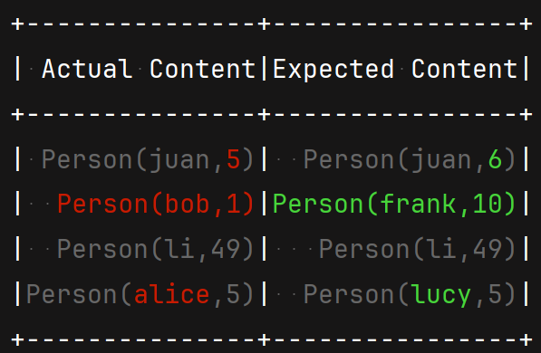
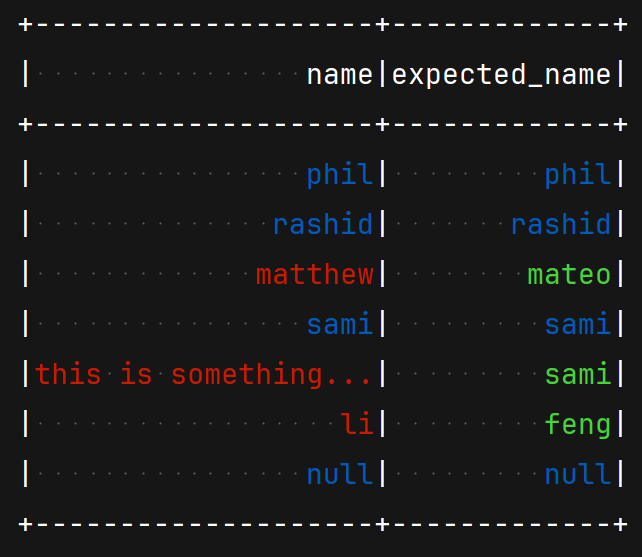

# Spark Fast Tests

[](https://github.com/MrPowers/spark-fast-tests/actions/workflows/ci.yml)

A fast Apache Spark testing helper library with beautifully formatted error messages!  Works
with [scalatest](https://github.com/scalatest/scalatest), [uTest](https://github.com/lihaoyi/utest),
and [munit](https://github.com/scalameta/munit).

Use [chispa](https://github.com/MrPowers/chispa) for PySpark applications.

Read [Testing Spark Applications](https://leanpub.com/testing-spark) for a full explanation on the best way to test
Spark code!  Good test suites yield higher quality codebases that are easy to refactor.

## Table of Contents
- [Install](#install)
- [Examples](#simple-examples)
- [Why is this library fast?](#why-is-this-library-fast)
- [Usage](#usage)
  - [Local Testing SparkSession](#local-sparksession-for-test)
  - [DataFrameComparer](#datasetcomparer)
    - [Unordered DataFrames comparison](#unordered-dataframe-equality-comparisons)
    - [Approximate DataFrames comparison](#approximate-dataframe-equality)
    - [Ignore Nullable DataFrames comparison](#equality-comparisons-ignoring-the-nullable-flag)
  - [ColumnComparer](#column-equality)
  - [SchemaComparer](#schema-equality)
- [Testing tips](#testing-tips)


## Install

Fetch the JAR file from Maven.

```scala
// for Spark 3
libraryDependencies += "com.github.mrpowers" %% "spark-fast-tests" % "3.0.1" % "test"
```

**Important: Future versions of spark-fast-test will no longer support Spark 2.x. We recommend upgrading to Spark 3.x to
ensure compatibility with upcoming releases.**

Here's a link to the releases for different Scala versions:

* [Scala 2.11 JAR files](https://repo1.maven.org/maven2/com/github/mrpowers/spark-fast-tests_2.11/)
* [Scala 2.12 JAR files](https://repo1.maven.org/maven2/com/github/mrpowers/spark-fast-tests_2.12/)
* [Scala 2.13 JAR files](https://repo1.maven.org/maven2/com/github/mrpowers/spark-fast-tests_2.13/)
* [Legacy JAR files in Maven](https://mvnrepository.com/artifact/MrPowers/spark-fast-tests?repo=spark-packages).

You should use Scala 2.11 with Spark 2 and Scala 2.12 / 2.13 with Spark 3.

## Simple examples

The `assertSmallDataFrameEquality` method can be used to compare two DataFrames.

```scala
val sourceDF = Seq(
  (1),
  (5)
).toDF("number")

val expectedDF = Seq(
  (1),
  (3)
).toDF("number")

assertSmallDataFrameEquality(sourceDF, expectedDF)
```

<p>
    
</p>

The `assertSmallDatasetEquality` method can be used to compare two Datasets or DataFrames(Dataset).
Nicely formatted error messages are displayed when the Datasets are not equal. Here is an example of content mismatch:

```scala
val sourceDS = Seq(
  Person("juan", 5),
  Person("bob", 1),
  Person("li", 49),
  Person("alice", 5)
).toDS

val expectedDS = Seq(
  Person("juan", 6),
  Person("frank", 10),
  Person("li", 49),
  Person("lucy", 5)
).toDS
```

<p>
    
</p>

The colors in the error message make it easy to identify the rows that aren't equal. These method also supports
comparing DataFrames with different schemas.

```scala
val sourceDF = spark.createDF(
  List(
    (1, 2.0),
    (5, 3.0)
  ),
  List(
    ("number", IntegerType, true),
    ("float", DoubleType, true)
  )
)

val expectedDF = spark.createDF(
  List(
    (1, "word", 1L),
    (5, "word", 2L)
  ),
  List(
    ("number", IntegerType, true),
    ("word", StringType, true),
    ("long", LongType, true)
  )
)

assertSmallDataFrameEquality(sourceDF, expectedDF)
```

<p>
    
</p>

The `DatasetComparer` has `assertSmallDatasetEquality` and `assertLargeDatasetEquality` methods to compare either
Datasets or DataFrames.

If you only need to compare DataFrames, you can use `DataFrameComparer` with the associated
`assertSmallDataFrameEquality` and `assertLargeDataFrameEquality` methods. Under the hood, `DataFrameComparer` uses the
`assertSmallDatasetEquality` and `assertLargeDatasetEquality`.

*Note : comparing Datasets can be tricky since some column names might be given by Spark when applying transformations.
Use the `ignoreColumnNames` boolean to skip name verification.*

## Why is this library fast?

This library provides three main methods to test your code.

Suppose you'd like to test this function:

```scala
def myLowerClean(col: Column): Column = {
  lower(regexp_replace(col, "\\s+", ""))
}
```

Here's how long the tests take to execute:

| test method                    | runtime          |
|--------------------------------|------------------|
| `assertLargeDataFrameEquality` | 709 milliseconds |
| `assertSmallDataFrameEquality` | 166 milliseconds |
| `assertColumnEquality`         | 108 milliseconds |
| `evalString`                   | 26 milliseconds  |

`evalString` isn't as robust, but is the fastest.  `assertColumnEquality` is robust and saves a lot of time.

Other testing libraries don't have methods like `assertSmallDataFrameEquality` or `assertColumnEquality` so they run
slower.

## Usage

### Local SparkSession for test
The spark-fast-tests project doesn't provide a SparkSession object in your test suite, so you'll need to make one
yourself.

```scala
import org.apache.spark.sql.SparkSession

trait SparkSessionTestWrapper {

  lazy val spark: SparkSession = {
    SparkSession
      .builder()
      .master("local")
      .appName("spark session")
      .config("spark.sql.shuffle.partitions", "1")
      .getOrCreate()
  }

}
```

It's best set the number of shuffle partitions to a small number like one or four in your test suite. This configuration
can make your tests run up to 70% faster. You can remove this configuration option or adjust it if you're working with
big DataFrames in your test suite.

Make sure to only use the `SparkSessionTestWrapper` trait in your test suite. You don't want to use test specific
configuration (like one shuffle partition) when running production code.

### DatasetComparer
The `DatasetComparer` trait defines the `assertSmallDatasetEquality` method. Extend your spec file with the
`SparkSessionTestWrapper` trait to create DataFrames and the `DatasetComparer` trait to make DataFrame comparisons.

```scala
import org.apache.spark.sql.types._
import org.apache.spark.sql.Row
import org.apache.spark.sql.functions._
import com.github.mrpowers.spark.fast.tests.DatasetComparer

class DatasetSpec extends FunSpec with SparkSessionTestWrapper with DatasetComparer {

  import spark.implicits._

  it("aliases a DataFrame") {

    val sourceDF = Seq(
      ("jose"),
      ("li"),
      ("luisa")
    ).toDF("name")

    val actualDF = sourceDF.select(col("name").alias("student"))

    val expectedDF = Seq(
      ("jose"),
      ("li"),
      ("luisa")
    ).toDF("student")

    assertSmallDatasetEquality(actualDF, expectedDF)

  }
}
```

To compare large DataFrames that are partitioned across different nodes in a cluster, use the
`assertLargeDatasetEquality` method.

```scala
assertLargeDatasetEquality(actualDF, expectedDF)
```

`assertSmallDatasetEquality` is faster for test suites that run on your local machine.  `assertLargeDatasetEquality`
should only be used for DataFrames that are split across nodes in a cluster.

#### Unordered DataFrame equality comparisons

Suppose you have the following `actualDF`:

```
+------+
|number|
+------+
|     1|
|     5|
+------+
```

And suppose you have the following `expectedDF`:

```
+------+
|number|
+------+
|     5|
|     1|
+------+
```

The DataFrames have the same columns and rows, but the order is different.

`assertSmallDataFrameEquality(sourceDF, expectedDF)` will throw a `DatasetContentMismatch` error.

We can set the `orderedComparison` boolean flag to `false` and spark-fast-tests will sort the DataFrames before
performing the comparison.

`assertSmallDataFrameEquality(sourceDF, expectedDF, orderedComparison = false)` will not throw an error.

#### Equality comparisons ignoring the nullable flag

You might also want to make equality comparisons that ignore the nullable flags for the DataFrame columns.

Here is how to use the `ignoreNullable` flag to compare DataFrames without considering the nullable property of each
column.

```scala
val sourceDF = spark.createDF(
  List(
    (1),
    (5)
  ), List(
    ("number", IntegerType, false)
  )
)

val expectedDF = spark.createDF(
  List(
    (1),
    (5)
  ), List(
    ("number", IntegerType, true)
  )
)

assertSmallDatasetEquality(sourceDF, expectedDF, ignoreNullable = true)
```

#### Approximate DataFrame Equality

The `assertApproximateDataFrameEquality` function is useful for DataFrames that contain `DoubleType` columns. The
precision threshold must be set when using the `assertApproximateDataFrameEquality` function.

```scala
val sourceDF = spark.createDF(
  List(
    (1.2),
    (5.1),
    (null)
  ), List(
    ("number", DoubleType, true)
  )
)

val expectedDF = spark.createDF(
  List(
    (1.2),
    (5.1),
    (null)
  ), List(
    ("number", DoubleType, true)
  )
)

assertApproximateDataFrameEquality(sourceDF, expectedDF, 0.01)
```

### Column Equality

The `assertColumnEquality` method can be used to assess the equality of two columns in a DataFrame.

Suppose you have the following DataFrame with two columns that are not equal.

```
+-------+-------------+
|   name|expected_name|
+-------+-------------+
|   phil|         phil|
| rashid|       rashid|
|matthew|        mateo|
|   sami|         sami|
|     li|         feng|
|   null|         null|
+-------+-------------+
```

The following code will throw a `ColumnMismatch` error message:

```scala
assertColumnEquality(df, "name", "expected_name")
```

<p>
    
</p>

Mix in the `ColumnComparer` trait to your test class to access the `assertColumnEquality` method:

```scala
import com.github.mrpowers.spark.fast.tests.ColumnComparer

object MySpecialClassTest
  extends TestSuite
    with ColumnComparer
    with SparkSessionTestWrapper {

  // your tests
}
```

### Schema Equality

The SchemaComparer provide `assertSchemaEqual` API which is useful for comparing schema of dataframe schema

Consider the following two schemas:

```scala
val s1 = StructType(
  Seq(
    StructField("array", ArrayType(StringType, containsNull = true), true),
    StructField("map", MapType(StringType, StringType, valueContainsNull = false), true),
    StructField("something", StringType, true),
    StructField(
      "struct",
      StructType(
        StructType(
          Seq(
            StructField("mood", ArrayType(StringType, containsNull = false), true),
            StructField("something", StringType, false),
            StructField(
              "something2",
              StructType(
                Seq(
                  StructField("mood2", ArrayType(DoubleType, containsNull = false), true),
                  StructField("something2", StringType, false)
                )
              ),
              false
            )
          )
        )
      ),
      true
    )
  )
)
val s2 = StructType(
  Seq(
    StructField("array", ArrayType(StringType, containsNull = true), true),
    StructField("something", StringType, true),
    StructField("map", MapType(StringType, StringType, valueContainsNull = false), true),
    StructField(
      "struct",
      StructType(
        StructType(
          Seq(
            StructField("something", StringType, false),
            StructField("mood", ArrayType(StringType, containsNull = false), true),
            StructField(
              "something3",
              StructType(
                Seq(
                  StructField("mood3", ArrayType(StringType, containsNull = false), true)
                )
              ),
              false
            )
          )
        )
      ),
      true
    ),
    StructField("norma2", StringType, false)
  )
)

```

The `assertSchemaEqual` support two output format `SchemaDiffOutputFormat.Tree` and `SchemaDiffOutputFormat.Table`. Tree
output
format is useful when the schema is large and contains multi level nested fields.

```scala
SchemaComparer.assertSchemaEqual(s1, s2, ignoreColumnOrder = false, outputFormat = SchemaDiffOutputFormat.Tree)
```

<p>
    
</p>

By default `SchemaDiffOutputFormat.Table` is used internally by all dataframe/dataset comparison APIs.

## Testing Tips

* Use column functions instead of UDFs as described
  in [this blog post](https://medium.com/@mrpowers/spark-user-defined-functions-udfs-6c849e39443b)
* Try to organize your code
  as [custom transformations](https://medium.com/@mrpowers/chaining-custom-dataframe-transformations-in-spark-a39e315f903c)
  so it's easy to test the logic elegantly
* Don't write tests that read from files or write files. Dependency injection is a great way to avoid file I/O in you
  test suite.

## Alternatives

The [spark-testing-base](https://github.com/holdenk/spark-testing-base) project has more features (e.g. streaming
support) and is compiled to support a variety of Scala and Spark versions.

You might want to use spark-fast-tests instead of spark-testing-base in these cases:

* You want to use uTest or a testing framework other than scalatest
* You want to run tests in parallel (you need to set `parallelExecution in Test := false` with spark-testing-base)
* You don't want to include hive as a project dependency
* You don't want to restart the SparkSession after each test file executes so the suite runs faster

## Publishing

GPG & Sonatype need to be setup properly before running these commands. See
the [spark-daria](https://github.com/MrPowers/spark-daria) README for more information.

It's a good idea to always run `clean` before running any publishing commands. It's also important to run `clean` before
different publishing commands as well.

There is a two step process for publishing.

Generate Scala 2.11 JAR files:

* Run `sbt -Dspark.version=2.4.8`
* Run `> ; + publishSigned; sonatypeBundleRelease` to create the JAR files and release them to Maven.

Generate Scala 2.12 & Scala 2.13 JAR files:

* Run `sbt`
* Run `> ; + publishSigned; sonatypeBundleRelease`

The `publishSigned` and `sonatypeBundleRelease` commands are made available by
the [sbt-sonatype](https://github.com/xerial/sbt-sonatype) plugin.

When the release command is run, you'll be prompted to enter your GPG passphrase.

The Sonatype credentials should be stored in the `~/.sbt/sonatype_credentials` file in this format:

```
realm=Sonatype Nexus Repository Manager
host=oss.sonatype.org
user=$USERNAME
password=$PASSWORD
```

## Additional Goals

* Use memory efficiently so Spark test runs don't crash
* Provide readable error messages
* Easy to use in conjunction with other test suites
* Give the user control of the SparkSession

## Contributing

Open an issue or send a pull request to contribute. Anyone that makes good contributions to the project will be promoted
to project maintainer status.

## uTest settings to display color output

Create a `CustomFramework` class with overrides that turn off the default uTest color settings.

```scala
package com.github.mrpowers.spark.fast.tests

class CustomFramework extends utest.runner.Framework {
  override def formatWrapWidth: Int = 300

  // turn off the default exception message color, so spark-fast-tests
  // can send messages with custom colors
  override def exceptionMsgColor = toggledColor(utest.ufansi.Attrs.Empty)

  override def exceptionPrefixColor = toggledColor(utest.ufansi.Attrs.Empty)

  override def exceptionMethodColor = toggledColor(utest.ufansi.Attrs.Empty)

  override def exceptionPunctuationColor = toggledColor(utest.ufansi.Attrs.Empty)

  override def exceptionLineNumberColor = toggledColor(utest.ufansi.Attrs.Empty)
}
```

Update the `build.sbt` file to use the `CustomFramework` class:

```scala
testFrameworks += new TestFramework("com.github.mrpowers.spark.fast.tests.CustomFramework")
```


